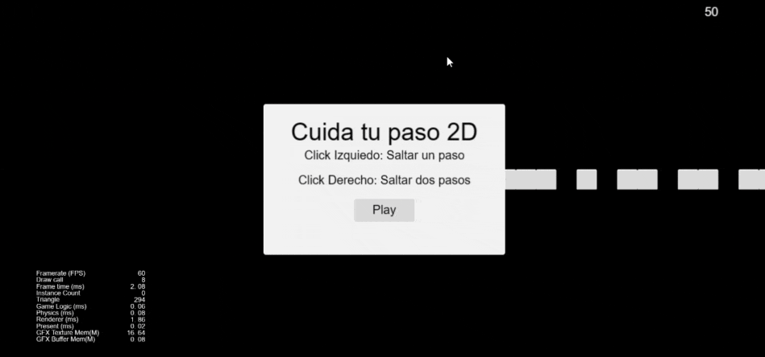

# Primer juego con Cocos Creator

Este repositorio contiene un juego de ejemplo desarrollado utilizando el motor de juegos Cocos Creator. Es un punto de partida ideal para comenzar a explorar el mundo del desarrollo de juegos utilizando esta poderosa herramienta.

## ¿Qué es este juego?
Este juego de ejemplo fue creado siguiendo el tutorial disponible en la [Pagina oficial](https://docs.cocos.com/creator/manual/en/getting-started/first-game-2d/) de Cocos Creator. Es un juego simple pero efectivo que demuestra los conceptos básicos de desarrollo de juegos 2D.

## Instrucciones
- Haz clic derecho para avanzar dos pasos.
- Haz clic izquierdo para avanzar un paso.
- ¡Si no pisas ningún cuadro el juego se reiniciará!.

Este proyecto marca el comienzo de mi viaje como desarrollador indie, y estoy emocionado de embarcarme en esta aventura de aprendizaje con Cocos Creator. ¡Espero que este juego sea solo el primero de muchos éxitos por venir!
